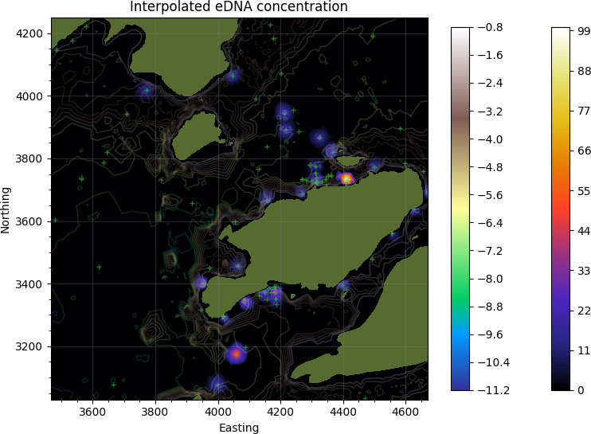

# eDNAmap
Interpolate eDNA concentration measurements.  

## To use the code:
Install python 2.x 
Install dependencies: pip install progressbar pyproj scipy numpy pandas stl pyshp fiona matplotlib
  
1. Execute interpolate_concentration.py 
   This script will construct triangular mesh, interpolate concentration and save results as ESRI shapefile in the Opinicon/Output folder
2. Execute tricontour.py 
   This script will produce contour plot of the triangular mesh  
