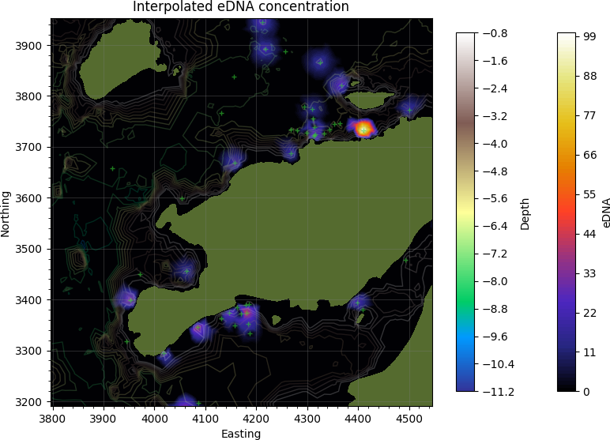

# eDNAmap
Interpolate eDNA concentration measurements.  

## Installation:
Install python 2.x 
Install dependencies: pip install progressbar pyproj scipy numpy pandas pyshp fiona matplotlib numpy-stl
  
## Usage:
1. Run interpolate_concentration.py 
   This script will construct triangular mesh and interpolate concentration. The resulting mesh is saved in several files: vertices, faces, segments, and holes in the Opinicon/Output folder for subsequent visualization. Interpolated points are combined with the data and saved as an ESRI shapefile.
2. Execute tricontour.py 
   This script will produce contour plot of the triangular mesh  
